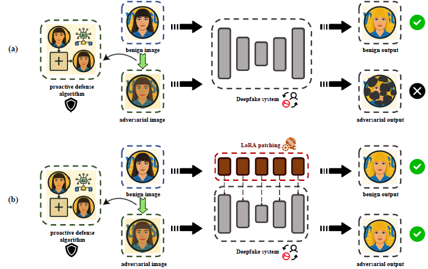

# LoRA Patching: Exposing the Fragility of Proactive Defenses against Deepfakes
Official PyTorch implementation of **LoRA Patching: Exposing the Fragility of Proactive Defenses against Deepfakes**.

This repository provides the source code for our paper, which introduces **LoRA Patching**, a plug-and-play approach for bypassing state-of-the-art proactive Deepfake defenses and enabling defensive watermarking. The method leverages lightweight Low-Rank Adaptation (LoRA) blocks inserted into Deepfake generators to adaptively neutralize adversarial perturbations while preserving editing capabilities on benign images.
<p align="center">
  
</p>


### 1. Preparing
Install the required dependency packages given in `requirements.txt`.

Follow Section 2 and 3 to download and configure the pre-trained model and dataset.

### 2. Pretrained model 

The weight files of the pre-trained Deepfake model and the Deepfake model fine-tuned with LoRA patches are available at [checkpoint](https://drive.google.com/drive/folders/1HhAl9ezpLLHzVbvm6XtnQYE6yTm-OWri?usp=sharing).

Please download them and put them at `LoRA-Patching/checkpoint/`.


### 3. Dataset
we provide a celebA-256-mini dataset, which contains 30,000 face images sampled from the celebA dataset and their attribute information, which you can get at [celebA-256-mini](https://drive.google.com/file/d/1v4KazZb9DFr_DpOFCwL-qGZc0AdYhBXq/view?usp=sharing), and put it at `LoRA-Patching/data/`.

### 4. Embedding LoRA for Deepfake

 A pair of LoRA matrices is inserted into each convolutional and deconvolutional layer of the Deepfake model to adjust the output. Each layer further includes a learnable gating parameter that adaptively trades off the patch’s influence.
<p align="center">

</p>

You can run the following code to embed the LoRA patch for your Deepfake model:

```python
from net.lora4conv import inject_lora

deepfake = load_model()
inject_lora(module=deepfake, r=rank, alpha=alpha, gated=True)
```

### 5. Fine-tuning the LoRA patch
Taking [StarGAN](https://github.com/yunjey/stargan) as an example (You can also train/test `attgan` or `HiSD`, which is provided in our implementation), you can run the following command to implement the **standard** LoRA patching for it:
```bash
python main.py --mode train --rank 8 --epochs 1 --gpus 0 --deepfake stargan
```

And you can run the following command to implement the **defensive** LoRA patching for it:

```bash
python main.py --mode train --rank 16 --epochs 5 --gpus 0 --deepfake stargan --warning True
```

### 6. Test

You can run the following command to test the **standard** LoRA patching:
```bash
python main.py --mode test --rank 8 --gpus 0 --deepfake stargan
```
The visualization results are as follows:


And You can run the following command to test the **defensive** LoRA patching:

```bash
python main.py --mode test --rank 16 --gpus 0 --deepfake stargan --warning True
```

The visualization results are as follows:


If you want to evaluate the performance in a leakage scenario (i.e., a patched deepfake is accessible to the defender), you can run the following command:

```bash
python main.py --mode test --rank 8 --gpus 0 --deepfake stargan --leakage True
```

or

```bash
python main.py --mode test --rank 16 --gpus 0 --deepfake stargan --warning True --leakage True
```


[Disrupting](https://github.com/natanielruiz/disrupting-deepfakes) is selected as the baseline proactive defense.


